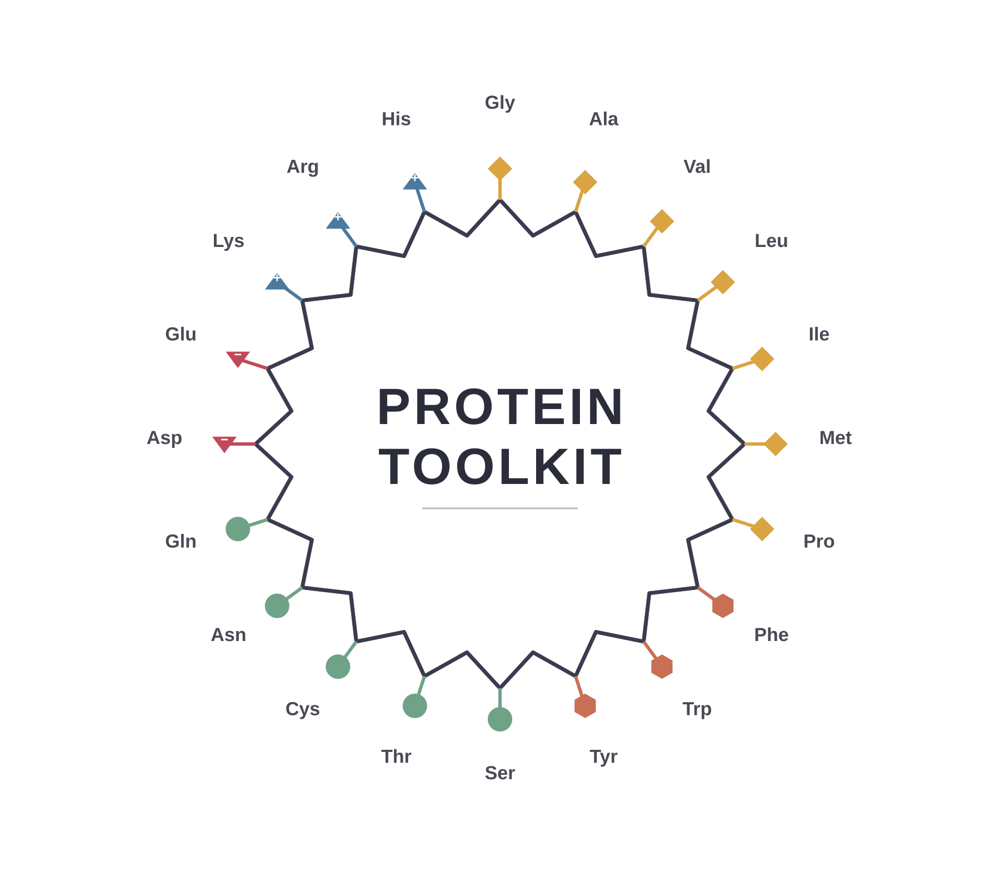

<p align="center">
  
</p>

# Protein Toolkit

A toolkit for calculating physicochemical properties of a protein from
its amino acid sequence. It provides two front-ends over the same
calculation code: a desktop app (Tkinter) and a web app (Streamlit).

## What it does

Paste a sequence, load a FASTA file, or **fetch by UniProt accession**
(e.g. `P69905`) and get:

> The single-sequence view analyses **one chain**. If the input holds more
> than one FASTA record it stops and offers to hand the input to batch
> mode, rather than silently concatenating the chains (which would give a
> wrong molecular weight and pI).

- Molecular weight, theoretical pI, net charge at pH 7
- Molecular formula and atomic composition (C / H / N / O / S, total atoms)
- GRAVY (hydropathy), aliphatic index, instability index, aromaticity
- Extinction coefficients (reduced / oxidized) for UV-based quantification
- Estimated secondary structure fraction (helix / turn / sheet)
- Amino acid composition, shown both as a bar chart and as a table
- Export to `.xlsx` (centred cells, frozen header) or `.csv` — the file
  contains exactly the rows shown in the Results panel

### Batch mode

**File → Batch analysis…** analyses many sequences at once. Paste FASTA
text or load **one or more FASTA files** (multiple files are appended, so
you can build up a set across several picks). Every record is analysed
independently; a record that can't be analysed is flagged in the table
instead of aborting the run. Select rows and press **Delete** to drop
them before exporting.

The batch table shows the **full property set** (one row per record,
horizontally scrollable). **Export** writes exactly those rows and
columns to `.xlsx` (centred cells) or `.csv`. Composition columns
(`aa_percent_*`, `ss_*_pct`) are true percentages and all floats are
rounded.

## Installation

```bash
python -m venv venv
source venv/bin/activate      # Windows: venv\Scripts\activate
pip install -r requirements.txt
```

`tkinter` ships with most Python installations. On some Linux
distributions it needs a separate system package:

```bash
sudo apt install python3-tk
```

## Running

Desktop app (Tkinter):

```bash
python run.py
```

Web app (Streamlit) — same `core/` calculations, no Tkinter/Matplotlib:

```bash
streamlit run streamlit_app.py
```

To publish the web app: push to GitHub, create an app at
[share.streamlit.io](https://share.streamlit.io) pointing at
`streamlit_app.py`. To embed it in another site (e.g. Google Sites),
append `?embed=true` to the deployed URL. Set `GITHUB_URL` at the top of
`streamlit_app.py` to your repo.

## Running tests

```bash
python -m unittest discover -s tests
```

## Using the calculation code from Python

The `core/` package has no GUI dependencies, so it can be imported
directly from a script, a notebook, or another tool.

```python
from core.sequence_props import calculate_properties, calculate_batch
from core.uniprot import fetch_fasta

# --- one sequence (raw text or a single-record FASTA string) ---
seq = "MVLSPADKTNVKAAWGKVGAHAGEYGAEALERMFLSFPTTKTYFPHF"
p = calculate_properties(seq)

p.molecular_weight_da        # 5173.9
p.isoelectric_point          # 8.14
p.molecular_formula          # 'C239H356N60O65S2'
p.aliphatic_index            # 58.3
p.amino_acid_percent["A"]    # 0.149  (fraction 0–1; ×100 for percent)
p.warnings                   # [] unless non-standard residues were found

# --- fetch straight from UniProt (needs internet) ---
p = calculate_properties(fetch_fasta("P69905"))

# --- many records at once ---
multi = ">chainA\nMVLSPADKTNVK\n>chainB\nMVHLTPEEKSAVT\n"
for row in calculate_batch(multi):
    if row.error:
        print(row.record_id, "->", row.error)
    else:
        print(row.record_id, round(row.properties.molecular_weight_da, 1))
```

`calculate_properties` raises `MultipleRecordsError` (a `ValueError`
subclass) if given more than one FASTA record — use `calculate_batch`
for that.

## Project structure

```
protein_toolkit/
├── core/                     # calculation logic (no GUI dependencies)
│   ├── sequence_props.py     # physicochemical descriptors + batch runner
│   ├── fasta.py              # multi-record FASTA parser
│   └── uniprot.py            # fetch a sequence by accession (stdlib only)
├── gui/                       # Tkinter desktop interface
│   └── app.py
├── streamlit_app.py           # Streamlit web interface (reuses core/)
├── tests/
│   ├── test_sequence_props.py
│   ├── test_fasta.py
│   ├── test_batch.py
│   ├── test_uniprot.py       # network stubbed out, runs offline
│   └── test_export.py
├── run.py
├── requirements.txt
├── protein_toolkit_logo.png
├── LICENSE
└── README.md
```

Calculation logic is deliberately kept separate from the interface: the
Tkinter desktop app and the Streamlit web app are two thin front-ends
over the same `core/` functions.

## License

MIT — see [LICENSE](LICENSE).
